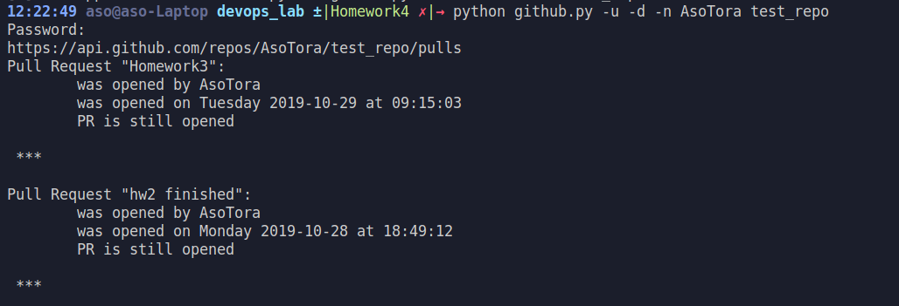

# Overview
Create script to get PR(Pull Request) statistics from GitHub. By Andrei Shvedau

## Usage
``` 
pr-stats [options] <user> [<repo>] 
pr-stats --version 
pr-stats (-h | --help)
```

### Defaults
Username -- requiered.

Repository -- https://github.com/octocat/Hello-World

### Example


## Options

- Show help. 
- Print the program's installed version  
- User who opened. 
- Day of the week opened.
- Number of days opened. 

